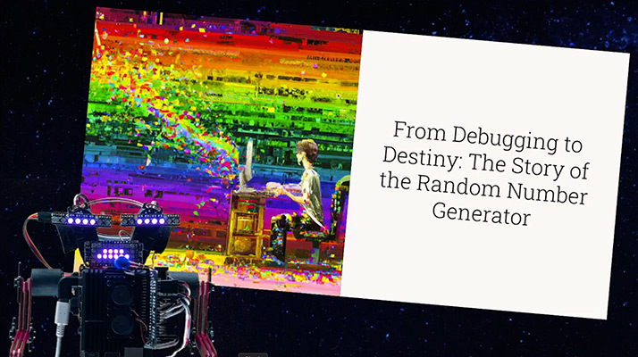

# AI Video Planner

Partner with AI to generate a detailed guide that can be used to automate the spoken script, filming and production of storytelling through video.

This project was created to:

1. Sharpen and showcase the React skills with a complex project in a hurry.
2. Explore partnering with AI to generate everything needed to fuel semi-automated video shorts e.g YouTube entertainment. I built a robot that could* serve as a video host and I want to try it out while polishing skills.

Next.js (React with layer of opinion and utils added) will be used in this project for its built-in routing, TypeScript, Tailwind CSS and server-side rendering enhancements to get to more React-y tasks quickly.